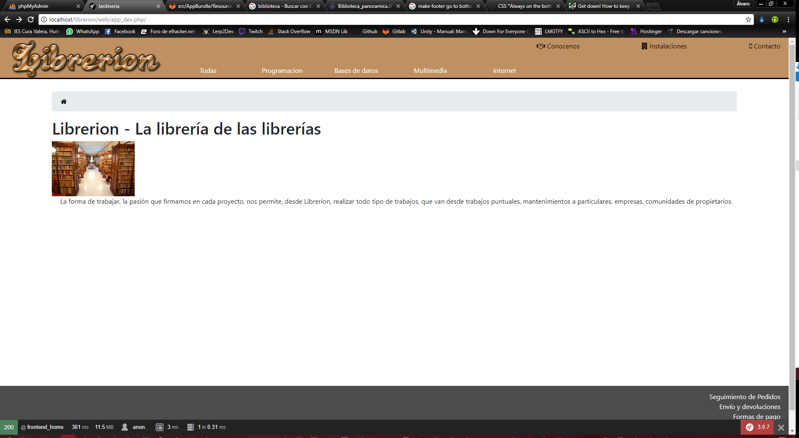

Proyecto Symfony para Morgado
=============================

Hola Morgado, este trimestre casi no te entrego proyecto, al menos voy a explicarte unas cuantas cosas que he ido descubriendo a lo largo del desarrollo del pseudoproyecto que he hecho.
Lo primero he decir, que la base de datos de jardinería que tu hiciste no es válida para insertar datos con Doctrine, por ello tuve que migrarme a la BBDD de librería si, pero como en su momento estuve bregando con la otra BBDD he perdido mucho tiempo y he tenido que rehacer el proyecto a partir del examen que hemos hecho esta mañana.

Asi es como se ve la portada:

... Coninuar por aquí ...

-----------------------------

Bibliografia:
-------------

Para el modal de Bootstrap (lo que añade y edita los objetos):

https://getbootstrap.com/docs/3.3/javascript/

Para una correcta instalación de popper sin tener que liarnos con el **npm**:

    

Para generar un Type a partir de una entidad:

**php bin/console generate:doctrine:form <nombre_entidad> (ejemplo: BDBundle:Productos)**

Y ahora para generar un formulario es tan simple como:

https://blog.intelligentbee.com/2015/01/19/symfony-2-forms-and-ajax/

Ya que esto está hecho para Symfony 2, con estas dos soluciónes arreglamos todo:

Para crear formularios utilizando *createForm* debemos usar {clase}::class no new {clase}(): https://stackoverflow.com/questions/34180818/expected-argument-of-type-string-vendor-namebundle-form-entitynametype-give

Hay un pequeño problema con las entidades y las claves foraneas, en resumen, internamente Synfony cuando crea el formulario empieza recorrer los objetos de la Entidad, si usamos claves foraneas el campo de la entidad primaria devolverá el objeto por completo, mientras que lo que busca el metodo que crea el formulario es una string, asi que haciendo esto arreglamos dicho problema: https://stackoverflow.com/questions/28710085/symfony2-catchable-fatal-error-object-of-class-could-not-be-converted-to-string

Provisional .. : https://stackoverflow.com/questions/12462220/steps-to-move-symfony-2-project-to-hosting

## Mi opinión:

Pienso que Symfony es un Framework potente, pero quizás algo complejo para el que este comenzando en las tecnologías web. Me han mencionado que Laravel es un tanto más sencillo.

Quizás la dificultad se encuentre en ir de un lado a otro, pero cuando lo pillas es muy sencillo.

En este documento he reunido los documentos más importantes a groso modo para generalizar cuanto más mejor el procedimiento para hacer formularios y demás, para que si en un futuro se vuelve a explicar se puedan coger apuntes y código de aquí, para que otros alumnos puedan aprender más rápido y de tiempo a meter cuantas más cosas (mejor, ya que asi se conseiguen dominar mñas aspectos del frontend, necesarios para un desarrollo con un abanico mayor de posibilidades, ya sea como autónomo o trabajando para alguien).