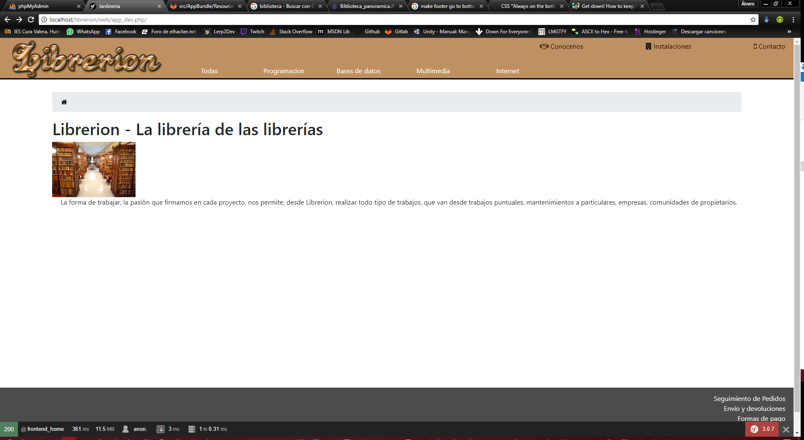

Proyecto Symfony para Morgado
=============================

Hola Morgado, este trimestre casi no te entrego proyecto, al menos voy a explicarte unas cuantas cosas que he ido descubriendo a lo largo del desarrollo del pseudoproyecto que he hecho.
Lo primero he decir, que la base de datos de jardinería que tu hiciste no es válida para insertar datos con Doctrine, por ello tuve que migrarme a la BBDD de librería si, pero como en su momento estuve bregando con la otra BBDD he perdido mucho tiempo y he tenido que rehacer el proyecto a partir del examen que hemos hecho esta mañana.

Asi es como se ve la portada:

Hasta esta tarde...